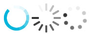
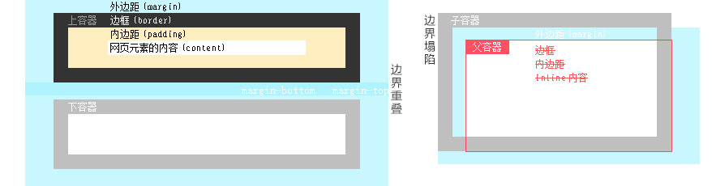
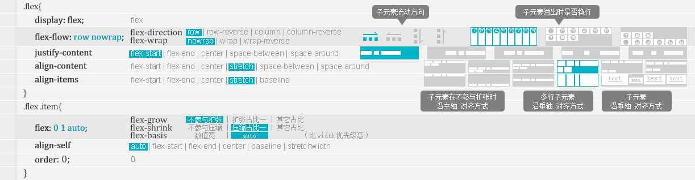

v-integer

Vue.directive('integer', {
  inserted(el, binding, vnode) {
    el.oninput = function (e) {
      let value = e.target.value
      if (value.indexOf('.') > -1) {
        value = value.replace('.', '')
        vnode.context.num = e.target.value = value
        return
      }
      if (isNaN(value)) {
        value = value.slice(0,value.length-1)
        vnode.context.num = e.target.value = value
        return
      }
    }
  }
})


### Loading [detail3](code/001?id=loading)
<br>


### 引入字体
```css
@font-face {
 font-family: 'datefont';
 src: url('YourWebFontName.eot'); /* IE9 Compat Modes */
 src: url('YourWebFontName.eot?#iefix') format('embedded-opentype'), /* IE6-IE8 */
   url('YourWebFontName.woff') format('woff'), /* Modern Browsers */
   url('batmfo_.ttf') format('truetype'), /* Safari, Android, iOS */
   url('YourWebFontName.svg#YourWebFontName') format('svg'); /* Legacy iOS */
}
#id{font-family:datefont}
```

### SVG字体方案
```
```

# CSS变量
**var()函数声明**
```css

**根作用域 全局调用**
:root{
  --bar: 'hello'; 
  --foo: var(--bar)' world';

  --color: #4d4e53; /* 与font-size等正式属性一样，只是没有默认含义 */
  --size: 68px; /*如果变量值带有单位，就不能写成字符串*/
  --padding: 10px 20px;
  --margin-top: calc(2vh + 20px);     /*不同单位数值计算*/
  margin-top: calc(var(--gap) * 1px); /* 数值与字符连接时要使用calc函数 */
}
```
```css
body {
  --bar: 'hello'; 
  --foo: var(--bar)' world';
}
.demo {
  color: var(--foo, #f00); /* 变量值/默认值 */
}
/*兼容写法*/
a {
  color: #7F583F;
  color: var(--primary);
}
```
**JavaScript检测支持**
```js
const isSupported =
  window.CSS &&
  window.CSS.supports &&
  window.CSS.supports('--a', 0);

if (isSupported) {
  /* supported */
} else {
  /* not supported */
}
```
**JavaScript 操作 CSS 变量**<br>
```js
document.body.style.setProperty('--primary', '#7F583F');  // 设置变量
document.body.style.getPropertyValue('--primary').trim(); // 读取变量
document.body.style.removeProperty('--primary');          // 删除变量
```
**JavaScript 可以将值存入样式表**<br>
```js
const docStyle = document.documentElement.style;
document.addEventListener('mousemove', (e) => {
  docStyle.setProperty('--mouse-x', e.clientX);
  docStyle.setProperty('--mouse-y', e.clientY);
});
```
**JavaScript 与 CSS 通信**
`--foo: if(x > 5) this.width = 10;`


# 功能

**文本溢出：单行**
```css
.text{ 
  width: 40px; 
  white-space:nowrap;      /* 不换行 */ 
  overflow: hidden;        /* 必须设置 */ 
  text-overflow: ellipsis; /* 文本溢出时处理方式：修剪文本clip/省略号替被剪文本ellipsis/给定字符替被剪文本string */
}
```

**文本溢出：多行省略**
```css
.text {
  width: 40px; 
  overflow: hidden; 
  text-overflow: ellipsis;
  display: -webkit-box;    /*必须结合的属性 ，将对象作为弹性伸缩盒子模型显示 */
  -webkit-line-clamp: 2;   /*用来限制在一个块元素显示的文本的行数。*/
  -webkit-box-orient: vertical; /*必须结合的属性 ，设置或检索伸缩盒对象的子元素的排列方式 。*/
}
```

**文本不可选**
```
unselectable="on"  标签属性
user-select: none   样式属性 -webkit- -moz- -ms-
```
- none——不可选择
- auto——默认值，用户可以选中元素中的内容
- text——用户可以选择元素中的文本
- element——文本可选，但仅限元素的边界内(只有IE和FF支持)
- all——在编辑器内，如果双击或上下文点击发生在子元素上，该值的最高级祖先元素将被选中

**三角箭头三角形**
```
/*下拉箭头*/
.select:after{ 
  content: ''; display: block; width: 0; height: 0; 
  border-width:7px 5px 0px 5px;
  border-style: solid solid solid solid;
  border-color: #000 transparent transparent transparent;
}
```
**图片置灰**
```
img {
-webkit-filter: grayscale(100%);
-moz-filter: grayscale(100%);
-ms-filter: grayscale(100%);
-o-filter: grayscale(100%);
filter: grayscale(100%);
filter: gray;
}
```

**清除浮动**
```
选择符:after{
            content:".";
            clear:both;
            display:block;
            height:0;
            overflow:hidden;
            visibility:hidden;
              }
```

**IOS下可输入文本框**
`<div contenteditable="true" style="-webkit-user-select:text">`

/*滚动条样式*/
```
    .tabs-content::-webkit-scrollbar {/*滚动条整体样式*/
      width: 4px;     /*高宽分别对应横竖滚动条的尺寸*/
      height: 4px;
    }
    .tabs-content::-webkit-scrollbar-thumb {/*滚动条里面小方块*/
      border-radius: 5px;
      -webkit-box-shadow: inset 0 0 5px rgba(0,0,0,0.2);
      background: rgba(90,90,90,1);
    }
    .tabs-content::-webkit-scrollbar-track {/*滚动条里面轨道*/
      -webkit-box-shadow: inset 0 0 5px rgba(0,0,0,0.2);
      border-radius: 0;
      background: rgba(0,0,0,0.5);
    }
```


# 排版

<div class="color-group color-card inline collapse c-atv-0">
  <i>font-weight</i> 字体粗细    
  <i>font-size</i> 字号大小  
  <i>line-height</i> 行高  
  <i>font-family</i> 字体 
</div><br><br>
<div class="color-group sz22 quote-arrow card">
  font:
  <i>bold</i> 
  <i>12px</i>/ 
  <i>18px</i>
  <i>Arial, Helvetica, sans-serif</i>;
</div>

**去除超链接背景** `-webkit-tap-highlight-color:rgba(0,0,0,0);`

**字与字间距_字符间距离** `letter-spacing: 10px;`

**首行自动空两格** `text-indent: 2em;`

**向左缩进,隐藏文本** `text-indent: -9999px;`

DEMO: 
```css
p{ 
  text-indent: 2em; 
  padding:0px; 
  margin:0px; 
}
```

**去除图片底部空隙**
```css
div{ font-size:0px }
div img{ margin:0;padding:0;}
```

**去除触摸高亮** `-webkit-tap-highlight-color:rgba(0,0,0,0);`

**去掉 button 点击 蓝框 去掉按钮阴影 蓝边** `outline:none;`


**清除 input 阴影** `-webkit-appearance: none;`


**table** `border-collapse:collapse;`

#### 选择器
<div class="color-group color-card inline collapse c-atv-0">
  <i>elem</i> 表示任意元素    
  <i>attr</i> 任意属性名称  
  <i>value</i> 值 
</div><br>
<div class="color-group">
  <i>elem</i>[ 
  <i>attr</i>~=
  <i>value</i>]　匹配附带attr属性的elem元素，其中attr属性的值是以空格隔开的值列表，value是值列表中的一个独立值
</div>
<div class="color-group">
  <i>elem</i>[ 
  <i>attr</i>^=
  <i>value</i>]　匹配附带attr属性的elem元素，并且该属性值是以value作为开始的
</div>
<div class="color-group">
  <i>elem</i>[ 
  <i>attr</i>$=
  <i>value</i>]　匹配附带attr属性的elem元素，并且该属性值是以value作为结束的
</div>
<div class="color-group">
  <i>elem</i>[ 
  <i>attr</i>*=
  <i>value</i>]　匹配附带attr属性的elem元素，并且该属性值包含value字符
</div>
```
.color-group i:nth-child(1){color: #318ed8;}   序号优先 第1个元素 匹配<i>
.color-group i:nth-of-type(1){color: #318ed8;} 类型优先 元素<i> 匹配第1个
```


#### 元素 

- 行内：a、b、span、img、input、strong、select、label、em、button、textarea
- 块级：div、ul、li、dl、dt、dd、p、h1-h6、blockquote
- 空：br、meta、hr、link、input、img

##### 盒子模型(Box Model) 
<br>
- 边界重叠:上div的margin-bottom和下div的margin-top不会叠加，而是取值其一大者
- 边界塌陷:父级div无border，padding，inline content，则子div的margin会一直向上找参考元素


## 轴线一维布局(弹性盒子)
<br>
```css
.flex{
　display: flex;　
　flex-flow: row nowrap; 　
　justify-content: flex-start; 
　align-content: stretch; 
　align-items: stretch; 
}
.flex .item{
　flex: 0 1 auto;
　align-self: auto;
　order: 0;
}
```
## 网格二维布局
概念：容器(container) 项目(item)  行(row)   列(column)  单元格(cell)  网格线(grid line) 片段(fraction) 区域(area)
http://www.ruanyifeng.com/blog/2019/03/grid-layout-tutorial.html
```
.grid {
  display: grid;                                  // inline-grid
  
  grid-template-columns: 100px 100px 100px;       // 每一列的列宽 重复值写法:repeat(3, 33.33%) 重复模式写法:repeat(2, 100px 20px 80px) 容纳尽可能多未知数量单元格：repeat(auto-fill, 100px) 比例关系：150px 1fr 2fr; 范围：1fr 1fr minmax(100px, 1fr); 其余：100px auto 100px 指定网格线的名字方便引用：[c1] 100px [c2] 100px [c3] auto [c4]
  grid-template-rows: 100px 100px 100px;          // 每一行的行高 同上
  grid-template-areas: "a b c"                    // 定义区域 网格线自动命名为 区域名-start 区域名-end
                       "d e f"
                       "g h i";
  grid-template-areas: "header header header"     // 合并区域
                       "main main sidebar"
                       "footer footer footer";
  grid-template-areas: "a . c"                    // 某些区域不需要利用
                       "d . f"
                       "g . i";

  grid-auto-columns   // 浏览器自动创建的多余网格的列宽和行高
  grid-auto-rows 属性
  grid-auto-flow: column;                         // cell流动方向: row/column 某些项目指定位置以后剩下的项目怎么自动放置: row dense/column dense
  
  grid-template: <grid-template-columns><grid-template-rows><grid-template-areas>
  grid:          <grid-template-columns><grid-template-rows><grid-template-areas><grid-auto-columns><grid-auto-rows><grid-auto-flow>


  row-gap: 20px;                                  // 行间距
  column-gap: 20px;                               // 列间距
  gap: 20px 20px;                                 // 行列简写 省略了第二个值，第二个值等于第一个值  

  align-items:   start | end | center | stretch;  // 单元格的内容上下对齐
  justify-items: start | end | center | stretch;  // 单元格的内容左右对齐
  place-items: <align-items> <justify-items>;
  
  align-content:   start | end | center | stretch | space-around | space-between | space-evenly;      // 行行之间的布局方式
  justify-content: start | end | center | stretch | space-around | space-between | space-evenly;      // 列列之间的布局方式
  place-content: <align-content> <justify-content>
}
.grid .item{
  grid-column-start: 1; 左边框所在的垂直网格线序号 网格线名字：header-start 跨越网格数：span 2
  grid-column-end: 2;   右边框所在的垂直网格线序号 
  grid-row-start: 3;    上边框所在的水平网格线序号
  grid-row-end: 4;      下边框所在的水平网格线序号

  grid-column: <grid-column-start> / <grid-column-end>
  grid-row: <grid-row-start> / <grid-row-end>
  grid-area: <grid-column-start> / <grid-column-end> / <grid-row-start> / <grid-row-end>   可直接指定区域名：grid-area: e;

  z-index: 1;           项目的重叠顺序
  
  align-self: start | end | center | stretch;    单元格内容的水平位置 跟align-items  类似
  justify-self: start | end | center | stretch;  单元格内容的水平位置 跟justify-items类似
  place-self: <align-self> <justify-self>
}
```

## 变换
```
transform: translate3d(200px, 0, 0);    /*3D*/
transform: scale3d(1, 1, 1);
transform: rotate3d(0, 0, 1, 360deg);
transform: translate(0px, 0px) scaleX(1.00) scaleY(1.00);   /*2D*/
transform-origin: center bottom 基点
```

## 动画

```html
<style>
  div{ width: 600px; height: 230px }
  div{ background: #f00; transition:all 1s ease }
  div:hover{ background: #fff }
</style>
<div></div>

<style>
  div{ width: 200px; height: 130px; background: #f00 }
  div{ transform: rotate(0deg) scale(1, 1); transition:all 1s linear }
  div:hover{ transform: rotate(180deg) scale(.5, .5) }
</style>
<div></div>  
```

<div class="color-group color-card collapse c-atv-0">
  <i>transition-property</i> 属性枚举 <c i='1'></c><br> 
  <div class="c-item-1">
    none: 无属性<br>
    all: 全部属性<br>
    indent: 枚举属性 transition:width 1s ease, background 5s ease<br>
  </div>
  <i>transition-duration</i> 持续时间 <br>
  <i>transition-timing-function</i> 动画效果 <c i='2'></c><br>
  <div class="c-item-2">
    ease: 逐渐变慢<br>
    linear: 匀速<br>
    ease-in: 加速<br>
    ease-out: 减速<br>
    ease-in-out: 加速然后减速<br>
    cubic-bezier: 自定义<br>
  </div>
  <i>transition-delay</i> 延时<br>
</div><br>
<div class="color-group sz22 quote-arrow card">
  transition:
  <i>all</i> 
  <i>1s</i> 
  <i>linear</i>
  <i>2s</i> 
</div>


<br><br>
<div class="color-group color-card collapse c-atv-0">
  <i>animation-name</i> 动画名称<br>
  <i>animation-duration</i> 播放时长<br>
  <i>animation-delay</i> 延时时间<br>
  <i>animation-timing-function</i> 动画效果 <c i="1"></c><br>
  <div class="c-item-1">
    和transition中的transition-timing-function 中的值一样<br>
    linear	动画从头到尾的速度是相同的<br>
    ease	默认。动画以低速开始，然后加快，在结束前变慢<br>
    ease-in	动画以低速开始<br>
    ease-out	动画以低速结束<br>
    ease-in-out	动画以低速开始和结束<br>
    cubic-bezier(n,n,n,n)	在 cubic-bezier 函数中自己的值。可能的值是从 0 到 1 的数值
  </div>
  <i>animation-iteration-count[ 1 /2/infinite]</i> 播放次数，infinite无限次的播放<br>
  <i>animation-direction[ normal /alternate]</i> 播放方向 <c i='2'></c><br>
  <div class="c-item-2">
    normal向前播放,alternate轮流，向前 > 反方 > 向前...（animation-iteration-count>1时有效）
  </div>
  <i>animation-play-state[ running /paused]</i> 播放状态 属性规定动画正在运行还是暂停<br>
  <i>animation-fill-mode[ none /forwards/backwords/both]</i> 停止状态 <c i='3'></c><br>
  <div class="c-item-3">
    none（默认，回到动画没开始时的状态）<br>
    forwards（动画结束后动画停留在结束状态）<br>
    backwords（动画回到第一帧的状态）<br>
    both（根据animation-direction轮流应用forwards和backwards规则<br>
  </div>
</div>
<br>
<div class="color-group sz22 quote-arrow card">
  animation: 
  <i>fn</i> 
  <i>3s</i> 
  <i>2s</i> 
  <i>linear</i> 
  <i>infinite</i> 
  <i>alternate</i> 
  <i>running</i>
  <i>both</i>; 
</div><br>
@keyframes<br>

            
###### 可以暂停的动画
```
<style>
div{ width:100px; height:100px; background:red; position:absolute; top: 100px; animation:fn 15s linear }
.pause{ animation-play-state: paused }
.play{ animation-play-state:running }
@keyframes fn{ from {left:0px} to {left:500px} }
</style>
<div id="demo"></div>
<button onclick="document.getElementById('demo').className='pause'">暂停</button>
<button onclick="document.getElementById('demo').className='play'">播放</button>
```
###### 往复运动的动画
```
<style>
  div{ width:100px; height:100px; background:red; position:absolute; top: 100px; animation:fn 3s 5s linear 3 alternate both }
  @keyframes fn{ from {left:0px} to {left:500px} }
</style>
<div id="demo"></div>
```
###### css-动画框架
```
.test{
-webkit-animation-name: test;        /*动画名*/
-webkit-animation-duration: 1s;      /*历时*/
-webkit-animation-delay: .25s;       /*延时*/
-webkit-animation-fill-mode: both;   /*检索或设置对象动画时间之外的状态 none/forwards/backwards/both*/
-webkit-animation-iteration-count: infinite;  /*定义动画的播放次数 infinite*/
-webkit-transform-origin: center;    /*原点center/top/bottom/left/right*/
-webkit-transform-origin:50% 50%;
-webkit-animation-timing-function:linear;     /*动画的速度曲线 ease-out/linear...*/
steps(2, start/end)
}
@-webkit-keyframes test {
0% {
-webkit-transform: translate3d(200px, 0, 0);    /*3D*/
-webkit-transform: scale3d(1, 1, 1);
-webkit-transform: rotate3d(0, 0, 1, 360deg);
-webkit-transform: translate(0px, 0px) scaleX(1.00) scaleY(1.00);   /*2D*/
transform-origin: center bottom
}
}
```
###### 简写 
`animation: radar 2s infinite linear;`
###### 逐帧动画
`-webkit-animation:name 2s steps(1,start) infinite;`


#### Less
```
预编译：npm install less -g && cd 目录  &&  lessc login.less > login.css
也可使用解释器直接识别less文件：
<link rel="stylesheet/less" type="text/css" href="style.less">
<script src="less.min.js"></script>

模块引入：@import "style.less";  @import "style.css";
变量声明与使用：@color: #f00; .banner { color: @color; } h2 { color: @color; }
混入：.color(@val:#f00) { color:@val; } .banner { .color(#00f); }
条件表达式：
.mixin (@a) when (@a = 20px){ color:red; }
.mixin (@a) when (@a < 20px){ color:blue; }
.mixin (@a) { font-size: @a; }
h2 { .mixin(20px) }
字符串拼接：  content: '{@v}{@v2}'
变量拼字符:     .fz(@v:14){font-size: @v*1px}
内置函数： http://www.cnblogs.com/zfc2201/p/3493335.html


Sass
http://www.bubuko.com/infodetail-503964.html      安装参考成功
http://www.bubuko.com/infodetail-580464.html      参数配置参考成功

安装ruby:
1 下载 http://rubyinstaller.org/downloads/
2  win环境的安装很傻瓜，一路next就行了，不过记得在选择目录的时候，有个add to PATH选项一定要勾上；
3 CMD  输入gem install sass
    但是由于gem的默认原地址由于国内伟大的GFW原因可能连接不上导致无法安装，所以我们还需要替换一下。
    依次输入：
    gem sources –r http://rubygems.org/
    gem sources –a http://ruby.taobao.org/
    gem sources –l
    如果我们看到最后显示的地址只有国内淘宝提供的镜像地址就OK了
然后再输入gem install sass就可以了，完成后输入sass –v 就会返回sass的版本号。
上面的数据源失败可试下面的源
$ gem sources --add https://ruby.taobao.org/ --remove https://rubygems.org/
$ gem sources -l

Arguments:

161022失败
云盘software/前端  Ruby22-x64.rar 解压拷贝到C盘
161025
node安装包 云盘soft/前端
git安装包 云盘soft/前端
161110成功
手动安装sass，参考 ../Scss/安装

引入 @import "config";
变量 $win-width: 750; .banner{ width: $win-width+ px; }

混合
@mixin matrix($span) {
   >div{
position: absolute;
left: 0;
&:nth-child(1){ top: 0*$span + px }      
      >div{
height:$span + px;
width: $span + px;
position: absolute;
top: 0;
&:nth-child(1){ left: 0*$span + px }         
      }
   }
}
#main-table TBODY{ @include matrix(40) }
#view-table TBODY{ @include matrix(20) }
```

#### 字符串拼接

```
&:nth-child(1){ background-position: 0 0; left: 0; top: 0; background-color: #f27734}
&:nth-child(2){ background-position: -$puzzle-w/3+px 0; left: $puzzle-w/3+px; top: 0; background-color: #ef552f}
&:nth-child(3){ background-position: -$puzzle-w/3*2+px 0; left: $puzzle-w/3*2+px; top: 0; background-color: #f27734}
&:nth-child(4){ background-position-x: 0; background-position-y: -$puzzle-h/3+px;           left: 0; top: $puzzle-w/3+px; background-color: #ef552f}
&:nth-child(5){ background-position-x: -$puzzle-w/3+px; background-position-y: -$puzzle-h/3+px;          left: $puzzle-w/3+px; top: $puzzle-w/3+px; background-color: #f27734}
&:nth-child(6){ background-position-x: -$puzzle-w/3*2+px; background-position-y: -$puzzle-h/3+px;           left: $puzzle-w/3*2+px; top: $puzzle-w/3+px; background-color: #ef552f}
&:nth-child(7){ background-position-x: 0; background-position-y: -$puzzle-h/3*2+px;           left: 0; top: $puzzle-w/3*2px; background-color: #f27734}
&:nth-child(8){ background-position-x: -$puzzle-w/3+px; background-position-y: -$puzzle-h/3*2+px;           left: $puzzle-w/3+px; top: $puzzle-w/3*2+px; background-color: #ef552f}
&:nth-child(9){ background-position-x: -$puzzle-w/3*2+px; background-position-y: -$puzzle-h/3*2+px;           left: $puzzle-w/3*2+px; top: $puzzle-w/3*2+px; background-color: #f27734}

https://blog.csdn.net/madman0621/article/details/82454183
background-color
background-position
background-size
background-repeat
background-origin
background-clip
background-attachment
background-image
```

简写：
```
background: [background-color] [background-image] [background-repeat] [background-attachment] [background-position] / [ background-size] [background-origin] [background-clip];
background: #f00  url(img.png)  no-repeat  scroll  center center / 50%  content-box content-box;
```

#### 媒体查询@media
```js
@media screen and (min-width:1023px) { }
@media screen and (orientation:landscape) { }
/* 超小屏幕（手机，小于 768px） */
/* 没有任何媒体查询相关的代码，因为这在 Bootstrap 中是默认的（还记得 Bootstrap 是移动设备优先的吗？） */
/* 小屏幕（平板，大于等于 768px） */
@media (min-width: @screen-sm-min) { ... }
/* 中等屏幕（桌面显示器，大于等于 992px） */
@media (min-width: @screen-md-min) { ... }
/* 大屏幕（大桌面显示器，大于等于 1200px） */
@media (min-width: @screen-lg-min) { ... }
```
```js
@media (max-width: 1280px) {
    .container { width: 960px }
}
@media (min-width: 1280px) {
    .container { width: 1200px }
}
@media only screen and (max-width: 1068px){ } //仅电脑设备中的页面最大可见区域宽度为 1068px 时显示其定义的样式
@media only screen and (-webkit-min-device-pixel-ratio:1.5) and (max-width:735px),
only screen and (max-width:735px) and (min-resolution:1.5dppx),
only screen and (max-width:735px) and (min-resolution: 144dpi){ }

@supports (-webkit-text-fill-color:transparent) and ((background-clip:text) or (-webkit-background-clip:text)) {
    #main-header > .container .right #language-selector .current-language p {
        background-image: -webkit-gradient(left top, right top, color-stop(0, #4f29fe), color-stop(100%, #a93aff));
        background-image: -webkit-gradient(linear, left top, right top, from(#4f29fe), to(#a93aff));
        background-image: linear-gradient(90deg, #4f29fe 0, #a93aff);
        -webkit-background-clip: text;
        background-clip: text;
        -webkit-text-fill-color: transparent
    }
}
```


#### 3d旋转 
```
<style>
        #test { perspective: 1200px } /* 透视视图 */
        #test div{
            width: 350px; height: 200px; position: relative;
            transform-style: preserve-3d; /* 3D 转换 */
        }
        #test div img{ width: 350px; height: 200px; position: absolute; left: 0; top: 0 }
        #test div img:nth-child(2){ transform: rotateY(180deg) translateZ(1px) } /* 反转180度 并设置z轴让其置于图片背面 */
        #test:hover div{ animation: rolling 1.8s linear both }
        @-webkit-keyframes rolling{
            0% { -webkit-transform:rotate3d(0, 1, 0, 0deg) translateZ(1px); /* 反转180度 并设置z轴让其置于图片背面 */ }
            100% { -webkit-transform:rotate3d(0, 1, 0, 180deg) translateZ(1px); }
        }
</style>
<div id="test">
    <div>
        
        
    </div>
</div>
```
改进
```
<style>
  #test { perspective: 1200px; width: 350px; border:#f00 1px solid } /* 透视视图 */
  #test div{
    width: 350px; height: 200px; position: relative;
    transform-style: preserve-3d; /* 3D 转换 */
    transition:all 1.8s ease
  }
  #test div img{ width: 350px; height: 200px; position: absolute; left: 0; top: 0 }
  #test div img:nth-child(2){ transform: rotateY(180deg) translateZ(1px) } /* 反转180度 并设置z轴让其置于图片背面 */
  #test:hover div{ -webkit-transform:rotate3d(0, 1, 0, 180deg) }
</style>
<div id="test">
  <div>
    
    
  </div>
</div>
```
滑入滑出动画
```
<style>
	div img{ position:absolute; left:0px; top:0px;}
	div .img2{ left:-230px; transition:all 0.2s ease}	
	div:hover .img2{ left:0px;}
</style>
<div>	
	
		
</div>
```


#### 渐变
<!-- layout:start -->
  <strong>background: -webkit-linear-gradient</strong>(参数1, 参数2, 参数3);<br>
  参数1 渐变开始方向[ left | top | right | bottom | 50deg | -50deg ]<br>
  参数2 可以设置两个值，一个代表渐变的起始颜色；一个为渐变的起始位置，可以填 像素或者百分比（正负数都可以） 代表从此位置开始渐变<br>
  参数3 可以设置两个值，一个代表渐的终止颜色；一个为渐变的结束位置，可以填 像素或者百分比（正负数都可以） 代表从此位置结束渐变<br>
<!-- col:8 -->
  <div style="background: linear-gradient(#6960ff, #d060ff); color:#fff">
    <br>
    <strong style="color:#fff">线性上下</strong><br>
    linear-gradient(#6960ff, #d060ff) 
    <br><br><br>
  </div>
<!-- col:8 -->
  <div style="background: -webkit-linear-gradient(left, #6960ff, #d060ff); color:#fff">
    <br>
    <strong style="color:#fff">线性左右</strong><br>
    linear-gradient(left, #6960ff, #d060ff)
    <br><br><br>
  </div>
<!-- col:8 -->
  <div style="background: -webkit-linear-gradient(60deg, #6960ff, #d060ff); color:#fff">
    <br>
    <strong style="color:#fff">线性角度</strong><br>
    linear-gradient(60deg, #6960ff, #d060ff)
    <br><br><br>
  </div>
<!-- layout:end -->


<!-- layout:start -->
<!-- col:24 -->
  <div style="background: -webkit-linear-gradient(left, red, orange, yellow, green, blue, cyan, purple); color:#fff">
    <strong style="color:#fff">颜色枚举</strong><br>
    -webkit-linear-gradient(left, red, orange, yellow, green, blue, cyan, purple)
    <br>
  </div>
<!-- layout:end -->

<!-- layout:start -->
<!-- col:24 -->
  <div style="background: -webkit-linear-gradient(left, rgba(2,150,100,0.3), rgba(160,32,240,0.8)),url(../../assets/images/timg.jpg); color:#fff">
    <br><br><br>
    <strong style="color:#fff">背景图片的渐变</strong><br>
    linear-gradient(left, rgba(2,150,100,0.3), rgba(160,32,240,0.8)),url(../../assets/images/timg.jpg)
    <br><br>
  </div>
<!-- layout:end -->


<!-- layout:start -->
<!-- col:8 -->
  
<!-- col:8 -->
  
<!-- col:8 -->
  <div style="background: radial-gradient(#ffffff,#a5dffd,#5ed6fd);">
    <br>
    <strong>锥形过渡</strong><br>
    radial-gradient(#ffffff,#a5dffd,#5ed6fd); 
    <br><br><br>
  </div>
<!-- layout:end -->

##### 综合
<div class="color-group sz20 quote-arrow card">
  -webkit-gradient(
  <i>linear, </i> 
  <i>left top, </i> 
  <i>left bottom, </i>
  <i>from(#ccc), </i> 
  <i>to(#000)</i>)
</div>
<div class="color-group sz20 inline card">
  [
  <i>类型, </i> 
  <i>定位开始, </i> 
  <i>定位结束, </i>
  <i>开始颜色,</i> 
  <i>结束颜色</i>]
</div>


```
text-shadow: 0 1px  0  #eee ;  /*文本阴影[x, y, radius, color] */
-webkit-text-stroke: 6px #ff0000;  /*文本描边*/

box-shadow: 0 0 5px rgba(0,0,0,1);    /*Box阴影*/
box-shadow: 0 2px 1px rgba(100,100,100,.1), inset 0 1px 0 rgba(255,255,255,.75);
```

#### 有序列表序列号  计数器
```
div{
  counter-reset: span;    /* 创建一个计数器 */
  span{
    position: relative;
    &::before{
      content: counter(span); counter-increment: span;    /*计数累加*/
    }
  }
}
```


#### 验证 
```
<input class="phone" placeholder="请输入您广金所绑定的手机号" pattern="^1[3-9]\d{9}$" required>
<style>
/*===包含required的表单===*/
    /* 无效 */
input:required:invalid{ color: #f60 }
/* 有效 */
input:required:valid{ color: #03a81e }
</style>
```


#### reset
```
＊ {
      -webkit-touch-callout: none;    // 阻止长按图片之后呼出菜单提示复制的行为
      -webkit-text-size-adjust: none;   //禁用Webkit内核浏览器的文字大小调整功能
      -webkit-tap-highlight-color: rgba(0, 0, 0, 0);  //避免点击a标签或者注册了click事件的元素时产生高亮    
      -webkit-user-select: none;  //禁止用户进行复制.选择
      }

-webkit-overflow-scrolling:touch    //实现弹性滚动
```


#### 弹出层
```
<div class="pop-up">
    <div class="pu-bg"></div>
    <div class="pu-content"></div>
</div>
.pop-up{ width: 100%; height: 100% }
.pop-up, .pop-up .pu-bg, .pop-up .pu-content{position: absolute; top: 0; left: 0; right: 0; bottom: 0}
.pop-up .pu-bg{ background: #000; opacity: 0.35; width: 100%; height: 100%; z-index: 101}
.pop-up .pu-content{ width: 100%; height: 100%; z-index: 102}
```

#### 透明
```
/* older safari/Chrome browsers */  
-webkit-opacity: 0.5;  
/* Netscape and Older than Firefox 0.9 */  
-moz-opacity: 0.5;  
/* Safari 1.x (pre WebKit!) 老式khtml内核的Safari浏览器*/  
-khtml-opacity: 0.5;  
/* IE9 + etc...modern browsers */  
opacity: .5;  
/* IE 4-9 */  
filter:alpha(opacity=50);  
/*This works in IE 8 & 9 too*/  
-ms-filter:"progid:DXImageTransform.Microsoft.Alpha(Opacity=50)";  
/*IE4-IE9*/  
filter:progid:DXImageTransform.Microsoft.Alpha(Opacity=50); 
```


#### 背景过渡
```
.linear{ 
width:100%; 
height:600px; 
FILTER: progid:DXImageTransform.Microsoft.Gradient(gradientType=0,startColorStr=##15A216,endColorStr=#fafafa); /*IE*/ 
background:-moz-linear-gradient(top,#15A216,#fafafa);/*火狐*/ 
background:-webkit-gradient(linear, 0% 0%, 0% 100%,from(#15A216), to(#fafafa));/*谷歌*/ 
background-image: -webkit-gradient(linear,left bottom,left top,color-start(0, #15A216),color-stop(1, #fafafa));/* Safari & Chrome*/ 
filter: progid:DXImageTransform.Microsoft.gradient(GradientType=0,startColorstr='#15A216', endColorstr='#fafafa'); /*IE6 & IE7*/ 
-ms-filter: "progid:DXImageTransform.Microsoft.gradient(GradientType=0,startColorstr='#15A216', endColorstr='#fafafa')"; /* IE8 */ 
} 

参考：http://www.runoob.com/css3/css3-gradients.html

background-image:linear-gradient(left, red 100px, yellow 200px);


background-image:linear-gradient(left top, red 100px, yellow 200px);


background-image:linear-gradient(-45deg, red 100px, yellow 200px)

多点
#grad {
  background: -webkit-linear-gradient(red, green, blue); /* Safari 5.1 - 6.0 */
  background: -o-linear-gradient(red, green, blue); /* Opera 11.1 - 12.0 */
  background: -moz-linear-gradient(red, green, blue); /* Firefox 3.6 - 15 */
  background: linear-gradient(red, green, blue); /* 标准的语法 */
}
径向
#grad {
  background: -webkit-radial-gradient(red, green, blue); /* Safari 5.1 - 6.0 */
  background: -o-radial-gradient(red, green, blue); /* Opera 11.6 - 12.0 */
  background: -moz-radial-gradient(red, green, blue); /* Firefox 3.6 - 15 */
  background: radial-gradient(red, green, blue); /* 标准的语法 */
}
```

#### 初始化样式 init.css

淘宝
```
body, h1, h2, h3, h4, h5, h6, hr, p, blockquote, dl, dt, dd, ul, ol, li, pre, form, fieldset, legend, button, input, textarea, th, td { margin:0; padding:0; } 
body, button, input, select, textarea { font:12px/1.5tahoma, arial, \5b8b\4f53; } 
h1, h2, h3, h4, h5, h6{ font-size:100%; } 
address, cite, dfn, em, var { font-style:normal; } 
code, kbd, pre, samp { font-family:couriernew, courier, monospace; } 
small{ font-size:12px; } 
ul, ol { list-style:none; } 
a { text-decoration:none; } 
a:hover { text-decoration:underline; } 
sup { vertical-align:text-top; } 
sub{ vertical-align:text-bottom; } 
legend { color:#000; } 
fieldset, img { border:0; } 
button, input, select, textarea { font-size:100%; } 
table { border-collapse:collapse; border-spacing:0; }
```

新浪官网
```
body,ul,ol,li,p,h1,h2,h3,h4,h5,h6,form,fieldset,table,td,img,div{margin:0;padding:0;border:0;} 
body{background:#fff;color:#333;font-size:12px; margin-top:5px;font-family:"SimSun","宋体","Arial Narrow";} 
 
ul,ol{list-style-type:none;} 
select,input,img,select{vertical-align:middle;} 
 
a{text-decoration:none;} 
a:link{color:#009;} 
a:visited{color:#800080;} 
a:hover,a:active,a:focus{color:#c00;text-decoration:underline;}
```

网易官网
```
html {overflow-y:scroll;} 
body {margin:0; padding:29px00; font:12px"\5B8B\4F53",sans-serif;background:#ffffff;} 
div,dl,dt,dd,ul,ol,li,h1,h2,h3,h4,h5,h6,pre,form,fieldset,input,textarea,blockquote,p{padding:0; margin:0;} 
table,td,tr,th{font-size:12px;} 
li{list-style-type:none;} 
img{vertical-align:top;border:0;} 
ol,ul {list-style:none;} 
h1,h2,h3,h4,h5,h6{font-size:12px; font-weight:normal;} 
address,cite,code,em,th {font-weight:normal; font-style:normal;}
```

腾讯QQ官网
```
body,ol,ul,h1,h2,h3,h4,h5,h6,p,th,td,dl,dd,form,fieldset,legend,input,textarea,select{margin:0;padding:0} 
body{font:12px"宋体","Arial Narrow",HELVETICA;background:#fff;-webkit-text-size-adjust:100%;} 
a{color:#2d374b;text-decoration:none} 
a:hover{color:#cd0200;text-decoration:underline} 
em{font-style:normal} 
li{list-style:none} 
img{border:0;vertical-align:middle} 
table{border-collapse:collapse;border-spacing:0} 
p{word-wrap:break-word}
```

样式初始化代码总结
```
html, body, div, span, object, iframe,h1, h2, 
h3, h4, h5, h6, p, blockquote, pre,abbr, address, cite, code,del, dfn, 
em, img, ins,kbd, q, samp,small, strong, sub, sup, var,b, i,dl, dt, dd, 
ol, ul, li,fieldset, form, label, legend,table, caption, tbody, 
tfoot,thead,tr, th, td,article, aside, canvas, details, figcaption, 
figure, footer, header, hgroup, menu, nav, section, summary,time, mark, 
audio, video {
    margin:0;
    padding:0;
    border:0;
    outline:0;
    font-size:100%;
    vertical-align:baseline;
    background:transparent;
    outline-style:none;/*FF*/ 
}

body {
    line-height:1;
}
 
a{
    margin:0;
    padding:0;
    border:0;
    font-size:100%;
    vertical-align:baseline;
    background:transparent;
     
}
a:hover,a:focus{
    text-decoration:none;
    bblr:expression(this.onFocus=this.blur());/*IE*/
    outline-style:none;/*FF*/ 
    }
table {
    border-collapse:collapse;
    border-spacing:0;
}
 
input, select {
    vertical-align:middle;
}

/*css为clearfix，清除浮动*/
.clearfix::before,
.clearfix::after{
    content: "";
    height: 0;
    line-height: 0;
    display: block;
    visibility: hidden;
    clear: both;
}
.clearfix:after{clear:both;} 
.clearfix{ 
    *zoom:1;/*IE/7/6*/
}
```

#### 通用样式 
规范原则：越简单越好

common.css

```
.bd, .jc { font-weight: bold }                            /* 加粗 */
.ob, .xt { font-style:oblique; font-style:italic }  /* 斜体 */
.uline   { text-decoration: overline }                /* 上划线 */
.mline  { text-decoration: line-through }         /* 中划线 删除线 */
.bline   { text-decoration: underline }             /* 下划线 */ 取消 text-decoration:none
.ucase { text-transform:uppercase }              /* 全部大写字母 */
.hcase { text-transform:capitalize }                /* 每个单词以大写字母开头 */
.lcase  { text-transform:lowercase }               /* 全部小写字母 */

/**
 * 阶值类命名
 * 1 复词首字母拼接+值，组成属性名
 * 2 有负值时，在最后拼接负号'-'
 */
/*Font Size 0/12 => 48*/
.fs0 { font-size: 0px  } .fs20{ font-size: 20px } .fs30{ font-size: 30px } .fs40{ font-size: 40px }
.fs12{ font-size: 12px } .fs22{ font-size: 22px } .fs32{ font-size: 32px } .fs42{ font-size: 42px }
.fs14{ font-size: 14px } .fs24{ font-size: 24px } .fs34{ font-size: 34px } .fs44{ font-size: 44px }
.fs16{ font-size: 16px } .fs26{ font-size: 26px } .fs36{ font-size: 36px } .fs46{ font-size: 46px }
.fs18{ font-size: 18px } .fs28{ font-size: 28px } .fs38{ font-size: 38px } .fs48{ font-size: 48px }
/*Letter Spacing -4 -> 4*/
.lp1 { letter-spacing: 1px  } .lp1- { letter-spacing: -1px } 
.lp2 { letter-spacing: 2px  } .lp2- { letter-spacing: -2px } 
.lp3 { letter-spacing: 3px  } .lp3- { letter-spacing: -3px } 
.lp4 { letter-spacing: 4px  } .lp4- { letter-spacing: -4px }
/*Line Height 0 => 48*/
.lh0{ line-height: 0px } .lh10{ line-height: 10px } .lh20{ line-height: 20px } .lh30{ line-height: 30px } .lh40{ line-height: 40px }
.lh2{ line-height: 2px } .lh12{ line-height: 12px } .lh22{ line-height: 22px } .lh32{ line-height: 32px } .lh42{ line-height: 42px }
.lh4{ line-height: 4px } .lh14{ line-height: 14px } .lh24{ line-height: 24px } .lh34{ line-height: 34px } .lh44{ line-height: 44px }
.lh6{ line-height: 6px } .lh16{ line-height: 16px } .lh26{ line-height: 26px } .lh36{ line-height: 36px } .lh46{ line-height: 46px }
.lh8{ line-height: 8px } .lh18{ line-height: 18px } .lh28{ line-height: 28px } .lh38{ line-height: 38px } .lh48{ line-height: 48px }
/*Text-Indent缩进*/
.ti1{ text-indent: 1em } .ti2{ text-indent: 2em } .ti3{ text-indent: 3em }

/**
 * 有限枚举类命名：
 * 1 复词首字母拼接+值首字母，组成属性名
 */
.tal { text-align: left } .tac { text-align: center } .tar { text-align: right }


/*
 * 行内元素的基线
 * 相对于该元素所在行的基线
 * 的垂直对齐
 */
.vait,.vaih,.vabl,.vatop,.vamid,.vabom,.vatbom,.vattop,.vasub,.vasup { display: inline-block }
.vait { vertical-align: initial }      /*全局 设置属性的初始值——浏览器的默认定义值*/
.vaih { vertical-align: inherit }      /*     规定应该从父元素继承 vertical-align 属性的值*/

.vabl { vertical-align: baseline }     /* 默认 元素放置在父元素的基线上*/

.vatop   { vertical-align: top }             /* 把元素的顶端与行中最高元素的顶端对齐*/
.vamid { vertical-align: middle }       /* 把此元素放置在父元素的中部*/
.vabom  { vertical-align: bottom }       /* 把元素的顶端与行中最低的元素的顶端对齐*/

.vatt{ vertical-align: text-top }        /* 把元素的顶端与父元素字体的顶端对齐*/
.vatb{ vertical-align: text-bottom } /* 把元素的底端与父元素字体的底端对齐*/

.vasub { vertical-align: sub }          /* 垂直对齐文本的下标*/
.vasup { vertical-align: super }       /* 垂直对齐文本的上标*/

/*使用数值表示元素底部与父元素基线（baseline）的距离*/
.va0  { vertical-align: 0px   } .va2  { vertical-align: 2px   } .va4  { vertical-align: 4px   } .va6  { vertical-align: 6px   } .va8  { vertical-align: 8px   }
.va10{ vertical-align: 10px } .va12{ vertical-align: 12px } .va14{ vertical-align: 14px } .va16{ vertical-align: 16px } .va18{ vertical-align: 18px }
.va20{ vertical-align: 20px } .va22{ vertical-align: 22px } .va24{ vertical-align: 24px } .va26{ vertical-align: 26px } .va28{ vertical-align: 28px }

.va0{ vertical-align: 0px } .va10{ vertical-align: 10px } .va20{ vertical-align: 20px } .va30{ vertical-align: 30px } .va40{ vertical-align: 40px } .va50{ vertical-align: 50px }
.va1{ vertical-align: 1px } .va11{ vertical-align: 11px }
.va2{ vertical-align: 2px } .va12{ vertical-align: 12px } 
.va3{ vertical-align: 3px } .va13{ vertical-align: 13px } 
.va4{ vertical-align: 4px } .va14{ vertical-align: 14px } 
.va5{ vertical-align: 5px } .va15{ vertical-align: 15px }
.va6{ vertical-align: 6px } .va16{ vertical-align: 16px } 
.va7{ vertical-align: 7px } .va17{ vertical-align: 17px } 
.va8{ vertical-align: 8px } .va18{ vertical-align: 18px } 
.va9{ vertical-align: 9px } .va19{ vertical-align: 19px }  


/*使用百分数表示元素底部相对于父元素基线（baseline）移动相对于父元素高（height）的百分比*/
.vap10{ vertical-align: 10% } .vap20{ vertical-align: 20% } .vap30{ vertical-align: 30% } .vap40{ vertical-align: 40% }
.vap50{ vertical-align: 50% } .vap60{ vertical-align: 60% } .vap70{ vertical-align: 70% } .vap80{ vertical-align: 80% }
```