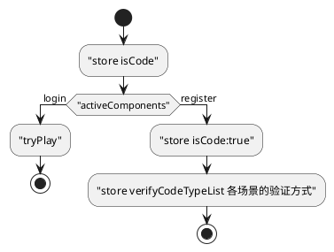
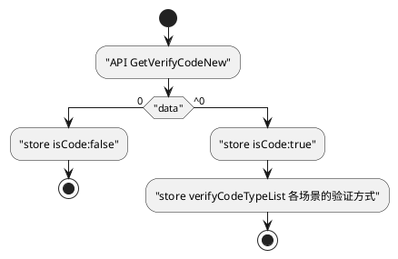

登录&注册交互kkkkddkkdkdkdk11111222333344455566777776666999888888887766678889999999999999999

```plantuml
@startuml
start
:"store isCode";
if ("activeComponents") then (login)
    :"tryPlay";
    stop
else (register)
    :"store isCode:true";
    :"store verifyCodeTypeList 各场景的验证方式";
    stop
endif
@enduml
```

登录验证

```plantuml
@startuml
start
:"API GetVerifyCodeNew";
if ("data") then (0)
    :"store isCode:false";
    stop
else (^0)
    :"store isCode:true";
    :"store verifyCodeTypeList 各场景的验证方式";
    stop
endif
@enduml
```