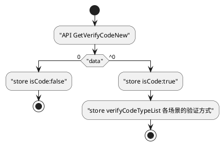

```block
store{
  isCode: false,           // 是否开启了验证码
  verifyCodeTypeList: {
    SceneUserLogin: 0,     // 登录开启哪一种验证码
    SceneAgentPostUser: 0, // 代理开下级开启哪一种验证码
    SceneFindUserPwd: 0,   // 找回密码开启哪一种验证码
    SceneUserRegister: 0   // 注册开启哪一种验证码
  }
}
```
```block
[API][/api/Api/][GetVerifyCodeNew]
----------------------------------
{
  state: "success",
  message: "NB103367 开启验证码",
  data: "1",
  type: {
    SceneUserLogin: 1,
    SceneAgentPostUser: 0,
    SceneFindUserPwd: 0,
    SceneUserRegister: 0,
    SceneUsdtDraw: -1,
  },
  msg: "0图形 1行为 2短信 3图形+短信,",
}
```
SCENE[
  {title:'验证策略', flow:[]}
]

