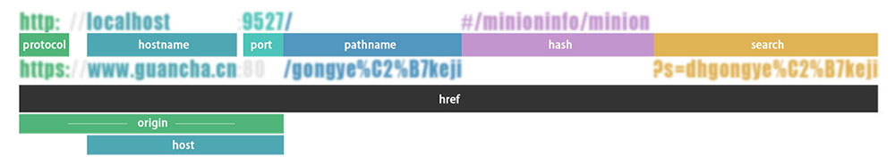
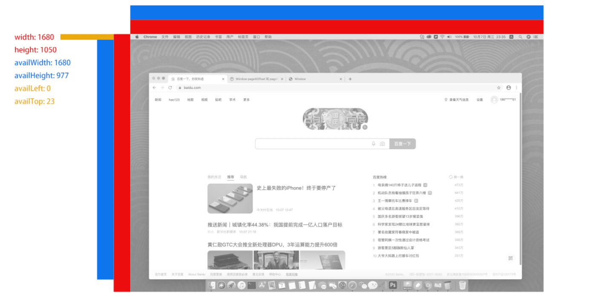

```
[SCENE]

```

#### 浏览器对象模型
  Browser Object Model 
#### 文档对象模型
  Document Object Model

#### Window
```
{
  document: [Document](pages/javascript/bom?id=document)
  location: [Location](pages/javascript/bom?id=location)
  navigator: [Navigator](pages/javascript/bom?id=navigator)
  screen: [Screen](pages/javascript/bom?id=screen)
  history: 
    length
    back()  
    forward()
    go(-2)
  frames

  setInterval(),
  setTimeout(),
  // 窗口位置
  pageXOffset: '',           // 设置或返回当前页面相对于窗口显示区左上角的 X 位置。
  pageYOffset: '',           // 设置或返回当前页面相对于窗口显示区左上角的 Y 位置。
  innerheight: '',           // 返回窗口的文档显示区的高度。
  innerwidth: '',            // 返回窗口的文档显示区的宽度。
  outerheight: '',           // 返回窗口的外部高度。
  outerwidth: '',            // 返回窗口的外部宽度。
  screenLeft: 0,
  screenTop: 23,
  screenX: 0,
  screenY: 23,
  // 其它属性
  name: '',                  // 设置或返回窗口的名称
  parent: '',                // 返回父窗口
  top: '',                   // 返回最顶层的先辈窗口
  external: {},
  // 状态栏
  defaultStatus: '',         // 窗口状态栏中的默认文本
  status: '',                // 临时设置窗口状态栏的文本
}
```
#### Document
```js
{
  title: '',                 //返回文档标题等价于HTML的title标签
  cookie: '',                //返回与当前文档有关的所有 cookie
  charset: '',               //返回字符集 简体中文:gb2312
  referrer: '',              //访问源URL，可作为返回上一页的依据
  body: {
    bgColor: '',             //设置或获取对象后面的背景颜色
    link: '',                //未点击过的链接颜色
    alink: '',               //激活链接(焦点在此链接上)的颜色
    vlink: '',               //已点击过的链接颜色
    text: '',                //文本色
    innerText: '',           //设置body>…/body>之间的文本
    innerHTML: '',           //设置body>…/body>之间的HTML代码
    topMargin: '',           //页面上边距
    leftMargin: '',          //页面左边距
    rightMargin: '',         //页面右边距
    bottomMargin: '',        //页面下边距
    background: '',          //背景图片
    appendChild(),           //(oTag) //动态生成一个HTML对象
    onclick(),               //=”func()”//鼠标指针单击对象是触发
    onmouseover(),           //=”func()”//鼠标指针移到对象时触发
    onmouseout(),            //=”func()”//鼠标指针移出对象时触发
  },                         //提供对 <body>元素的直接访问。对于定义了框架集的文档，该属性引用最外层的<frameset>。
  

  domain: '',                //返回当前文档的域名。
  bgColor: '',               //返回页面背景色
  fgColor: '',               //返回前景色(文本颜色)
  linkColor: '',             //未点击过的链接颜色
  alinkColor: '',            //激活链接(焦点在此链接上)的颜色
  vlinkColor: '',            //已点击过的链接颜色
  URL: '',                   //设置URL属性从而在同一窗口打开另一网页
  URL: '',                   //返回当前文档的 URL。
  fileCreatedDate: '',       //文件建立日期，只读属性
  fileModifiedDate: '',      //文件修改日期，只读属性
  lastModified: '',          //返回文档被最后修改的日期和时间。
  fileSize: '',              //文件大小，只读属性
  styleSheets: '',           //返回样式表的集合,返回值CSSStyleSheet[] //styleSheets[0].cssRules.style.paddingTop=”10px”//设置样式,样式名去掉连字符,
 
  write(),                   //动态向页面写入内容
  writeln()                  //等同于 write() 方法，不同的是在每个表达式之后写一个换行符。
  createElement()            //(<Tag>) //用指定标签类型创建一个新的element对象)
  getElementById()           //(ID) //获得指定ID值的对象
  getElementsByName()        //(Name) //获得指定Name值的对象
  getElementsByTagName()     //返回带有指定标签名的对象集合。
}
```
#### Location

```
◐编码&解码{'id':'Location','path':'pages/javascript/bom?id=Location','type':''}◑[DETAILB/Location02]
{
  protocol: "http:"
  hostname: "localhost" 
  port:     "9527"
  pathname: "/main"
  hash:     "#/minioninfo/minion"
  search:   "?v=1" ◐解析URL参数{'id':'Location','path':'pages/javascript/bom?id=Location','type':''}◑[DETAILB/Location01]
  host:     "localhost:9527"
  origin:   "http://localhost:9527"
  href:     "http://localhost:9527/main#/minioninfo/minion?v=1"  
}


▉Location01▉
解析search
let searchStr = location.search
searchStr = searchStr.replace(/^\?/g, '')   // 删除'?'字符
searchStr = searchStr.replace(/&/g, '","')  // '&'替换成','
searchStr = searchStr.replace(/=/g, '":"')  // '='替换成':'
searchStr = `{"${searchStr}"}`  // '='替换成':'
const obj = JSON.parse(searchStr)

简写：JSON.parse(`{"${location.search.replace(/^\?/g, '').replace(/&/g, '","').replace(/=/g, '":"')}"}`)▉

▉Location02▉
var uri="http://w3cschool.cc/my test.php?name=ståle&car=saab"
document.write(encodeURIComponent(uri))  // http%3A%2F%2Fw3cschool.cc%2Fmy%20test.php%3Fname%3Dst%C3%A5le%26car%3Dsaab

encodeURI/decodeURI 不能编码和解码URI特殊字符（如#，/，￥等）
∵ 
<table>
    <tr style="background:#eee"><td>编码</td><td>目标字符</td><td>结果字符</td> <td rowspan="3">></td> <td>解码</td><td>目标字符</td><td>结果字符</td></tr>
    <tr><td><strong>encodeURIComponent</strong>('#')</td><td>'#'</td><td>"%23"</td> <td><strong>decodeURIComponent</strong>('%23')</td><td>'%23'</td><td>"#"</td></tr>
    <tr><td><strong>encodeURI('#')</strong></td><td>'#'</td><td>"#"</td> <td><strong>decodeURI</strong>('%23')</td><td>'%23'</td><td>"%23"</td></tr>
</table>
∴▉
```


#### Navigator
```
浏览器信息: ◐判断当前设备及获取设备{'path':'pages/javascript/bom?id=navigator','type':''}◑[DETAILB/Navigator01]
{
  appCodeName: "Mozilla"  // 浏览器代码名 "Mozilla"
  appName: "Netscape"     // 浏览器步伐名 "Netscape"
  appVersion: "5.0 (Windows NT 10.0; Win64; x64) AppleWebKit/537.36 (KHTML, like Gecko) Chrome/86.0.4240.198 Safari/537.36"  // 返回浏览器的平台和版本信息 只读字符串
  cookieEnabled: true     // 浏览器是否撑持cookie

  bluetooth: Bluetooth {}
  clipboard: Clipboard {}
  connection: NetworkInformation {onchange: null, effectiveType: "4g", rtt: 100, downlink: 3.25, saveData: false}
  

  credentials: CredentialsContainer {}
  deviceMemory: 8
  
  doNotTrack: null
  geolocation: Geolocation {}
  hardwareConcurrency: 8
  keyboard: Keyboard {}
  language: "zh-CN"
  languages: (2) ["zh-CN", "zh"]
  locks: LockManager {}
  maxTouchPoints: 0
  mediaCapabilities: MediaCapabilities {}
  mediaDevices: MediaDevices {ondevicechange: null}
  mediaSession: MediaSession {metadata: null, playbackState: "none"}
  mimeTypes: MimeTypeArray {0: MimeType, 1: MimeType, 2: MimeType, 3: MimeType, application/pdf: MimeType, application/x-google-chrome-pdf: MimeType, application/x-nacl: MimeType, application/x-pnacl: MimeType, length: 4}
  onLine: true    // 用户否在线 true
  permissions: Permissions {}
  platform: "Win32"   // 操作体系类型 "Win32"
  plugins: PluginArray {0: Plugin, 1: Plugin, 2: Plugin, Chrome PDF Plugin: Plugin, Chrome PDF Viewer: Plugin, Native Client: Plugin, length: 3}  // 浏览器已经安装的插件集
  presentation: Presentation {defaultRequest: null, receiver: null}
  product: "Gecko"
  productSub: "20030107"
  serviceWorker: ServiceWorkerContainer {controller: ServiceWorker, ready: Promise, oncontrollerchange: null, onmessage: null, onmessageerror: null}
  storage: StorageManager {}
  usb: USB {onconnect: null, ondisconnect: null}
  userActivation: UserActivation {hasBeenActive: true, isActive: true}
  userAgent: "Mozilla/5.0 (Windows NT 10.0; Win64; x64) AppleWebKit/537.36 (KHTML, like Gecko) Chrome/86.0.4240.198 Safari/537.36"  //用户代理头的字符串表示
  vendor: "Google Inc."
  vendorSub: ""
  wakeLock: WakeLock {}
  webkitPersistentStorage: DeprecatedStorageQuota {}
  webkitTemporaryStorage: DeprecatedStorageQuota {}
  xr: XRSystem {ondevicechange: null}
}

▉Navigator01▉
function currDevice(){
  var u = navigator.userAgent;
  var app = navigator.appVersion;
  var browserLang = (navigator.browserLanguage || navigator.language).toLowerCase();    //获取浏览器语言
  return{
    trident: u.indexOf('Trident') > -1,                             //IE内核
    presto:  u.indexOf('Presto') > -1,                              //opera内核
    webKit:  u.indexOf('AppleWebKit') > -1,                         //苹果、谷歌内核
    gecko:   u.indexOf('Gecko') > -1 && u.indexOf('KHTML') == -1,   //火狐内核
    mobile:  !!u.match(/AppleWebKit.*Mobile.*/),                    //是否为移动终端
    ios:     !!u.match(/\(i[^;]+;( U;)? CPU.Mac OS X/),             //ios终端
    android: u.indexOf('Android') > -1 || u.indexOf('Linux') > -1,  //android终端或者uc浏览器
    iPhone:  u.indexOf('iPhone') > -1,                              //是否为iPhone或者QQHD浏览器
    iPad:    u.indexOf('iPad') > -1,                                //是否iPad
    webApp:  u.indexOf('Safari') == -1,                             //是否web应用程序，没有头部和底部
    weixin:  u.indexOf('MicroMessenger') > -1,                      //是否微信
    qq:      u.match(/\sQQ/i) == " qq",                             //是否QQ
  }
}▉

```

#### Screen

```
{
  width: 1680
  height: 1050
  availWidth: 1680
  availHeight: 977
  availLeft: 0
  availTop: 23

  colorDepth: 24
  pixelDepth: 24
  orientation: ScreenOrientation {angle: 0, type: "landscape-primary", onchange: null}
}
```

#### Element
```js
{
  accessKey: '',             //设置或返回元素的快捷键。
  attributes: '',            // 返回元素属性的集合。
  childNodes: {
    item(),                  //() 返回 NodeList 中位于指定下标的节点。
    length: '',              // 返回 NodeList 中的节点数。
  },                         // 返回元素子节点的 NodeList。
  className: '',             // 设置或返回元素的 class 属性。
  clientHeight: '',          // 返回元素的可见高度。
  clientWidth: '',           // 返回元素的可见宽度。
  contentEditable: '',       // 设置或返回元素的文本方向。
  dir: '',                   // 设置或返回元素的文本方向。
  firstChild: '',            // 返回元素的首个子。
  hidden: '',                // 获取或设置hidden属性的存在状态
  id: '',                    // 设置或返回元素的 id。
  innerHTML: '',             // 设置或返回元素的内容。
  isContentEditable: '',     // 设置或返回元素的内容。
  lang: '',                  // 设置或返回元素的语言代码。
  lastChild: '',             // 返回元素的最后一个子元素。
  namespaceURI: '',          // 返回元素的 namespace URI。
  nextSibling: '',           // 返回当前元素之后的兄弟元素
  nodeName: '',              // 返回元素的名称。
  nodeType: '',              // 返回元素的节点类型。
  nodeValue: '',             // 设置或返回元素值。
  offsetHeight: '',          // 返回元素的高度。
  offsetWidth: '',           // 返回元素的宽度。
  offsetLeft: '',            // 返回元素的水平偏移位置。
  offsetParent: '',          // 返回元素的偏移容器。
  offsetTop: '',             // 返回元素的垂直偏移位置。
  ownerDocument: '',         // 返回元素的根元素（文档对象）。
  parentNode: '',            // 返回元素的父节点。
  previousSibling: '',       // 返回当前元素之前的兄弟元素
  scrollHeight: '',          // 返回元素的整体高度。
  scrollLeft: '',            // 返回元素左边缘与视图之间的距离。
  scrollTop: '',             // 返回元素上边缘与视图之间的距离。
  scrollWidth: '',           // 返回元素的整体宽度。
  style: '',                 // 设置或返回元素的 style 属性。
  tabIndex: '',              // 设置或返回元素的 tab 键控制次序。
  tagName: '',               // 返回元素的标签名。
  textContent: '',           // 设置或返回节点及其后代的文本内容。
  title: '',                 // 设置或返回元素的 title 属性。
  add(),                     //(<class>)给元素添加指定的类
  appendChild(),             //() 向元素添加新的子节点，作为最后一个子节点。
  cloneNode(),               //() 克隆元素。
  compareDocumentPosition(), //() 比较两个元素的文档位置。
  getAttribute(),            //() 返回元素节点的指定属性值。
  getAttributeNode(),        //() 返回指定的属性节点。
  getElementsByTagName(),    //() 返回拥有指定标签名的所有子元素的集合。
  getFeature(),              //() 返回实现了指定特性的 API 的某个对象。
  getUserData(),             //() 返回关联元素上键的对象。
  hasAttribute(),            //() 如果元素拥有指定属性，则返回true，否则返回false。
  hasAttributes(),           //() 如果元素拥有属性，则返回 true，否则返回false。
  hasChildNodes(),           //() 如果元素拥有子节点，则返回 true，否则false。
  insertBefore(),            //(<a>,<b>) 在指定的已有的子节点之前插入新节点。A插到b前
  isDefaultNamespace(),      //() 如果指定的 namespaceURI是默认的，则返回true，否则返回false。
  isEqualNode(),             //(<a>) 检查a元素是否与当前元素相等。
  isSameNode(),              //(a) 检查指定元素是否就是当前元素.
  isSupported(),             //() 如果元素支持指定特性，则返回 true。
  normalize(),               //() 合并元素中相邻的文本节点，并移除空的文本节点。
  remove(),                  //(<class>) 从元素移除指定的类
  removeAttribute(),         //() 从元素中移除指定属性。
  removeAttributeNode(),     //() 移除指定的属性节点，并返回被移除的节点。
  removeChild(),             //(a) 从元素中移除子节点。
  replaceChild(),            //(a,b) 替换元素中的子节点。
  setAttribute(),            //() 把指定属性设置或更改为指定值。
  setAttributeNode(),        //() 设置或更改指定属性节点。
  setIdAttribute(),   
  setIdAttributeNode(),
  setUserData(),             //() 把对象关联到元素上的键。
  toggle(),                  //(<class>)如果类不存在就添加它存在就移除它
  toString(),                //() 把元素转换为字符串。
}
```

#### Event
```js
{
  screenX pageX layerX clientX
  
  type: '',                  //事件的名称如mouseover 字符串
  target: {}                 // Element
}
```