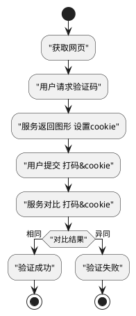

```
[CLASS none]
[MULU]


[h3 cg|分页]
[HTML]

[h3 cg|Enter提交表单]
<input type="text" onchange="console.log(this.value);" />
<input type="text" onkeydown="handleKeydown(event)" />
function handleKeydown(e){ console.log(e.keyCode) }

# 重复字符串
'&nbsp;'.repeat(space[0].length)


[h3 ch|用户账户体系]

特性：纯js 无依赖
要求：通用性 兼容性 可靠性 封装性
架构：
    搭建es6+工程环境：webpack babel  
    模块：common 登录 注册 账号设置 密码找回


[h3 ci|场景]
MPA
SPA
Portal
### 身份验证
chrome 身份验证器 插件
身份验证器用以在浏览器中生成二步认证代码

[h3 cj|微前端架构]
mkdir qiankun-platform & cd qiankun-platform
yarn add qiankun (无需如npm init)
mkdir main & cd main
touch index.html
  [cc|<!DOCTYPE html>
  <html>
  <head>
      <meta charset="UTF-8">
      <meta name="viewport" content="width=device-width, initial-scale=1.0">
      <title>Document</title>
  </head>
  <body>
      [b cg|<div id="view-01">loading...</div>]
  </body>
  </html>]
touch index.js
  [cc|import { [b ci|loadMicroApp] } from 'qiankun'
  // 加载微应用
  [b ci|loadMicroApp]({
    name: '应用一',
    entry: '//localhost:7100',
    container: '[b cg|#view-01]',
    props: {
      slogan: 'Hello View01'
    }
  })]

微前端架构旨在解决单体应用在一个相对长的时间跨度下，由于参与的人员、团队的增多、变迁，从一个普通应用演变成一个巨石应用(Frontend Monolith)后，随之而来的应用不可维护的问题
##### 使用场景
- 项目很多，规模很大，都是每个项目独立使用git此类仓库维护的、技术栈为vue/react/angular的这类应用
- 需要整合到统一平台上，你正在寻找可能比iframe更合适的替代方案
- 项目A有功能A1、A2、A3,项目B有功能B1、B2、B3，产品经理要你把A2、B1、B3组合成一个包含这些功能的新项目
[single-spa](https://zh-hans.single-spa.js.org/docs/getting-started-overview)
[qiankun乾坤](https://github.com/umijs/qiankun)
[文档](https://qiankun.umijs.org/zh)


$ vue create qiankun-demo   # 新建项目
$ cd qiankun-demo
$ npm run serve    # 项目启动
$ npm run build    # 打包

$ yarn add qiankun # 或者 npm i qiankun -S


#################### 运行时
文件结构

配置列表
CONF_BW = {
  THEME:     '主题站点',
  SKIN:      '主题皮肤',
  TITLE:     '站点标题',
  COPYRIGHT: '备案信息',
}
RES_PUBLIC: 'static/'
RES_PRIVATE: CONF_BW.THEME + '/'


场景：
新增一个主题站点
新增一个主题皮肤
主题皮肤变更指引：资源变迁 

#### 构建时
CONF_THEME = {
  THEME: {
    SKIN:      '主题皮肤',
    // 私有资源注册Private Resource Registration
    PRR:{
      addr: THEME // 可自定义
      res: []
    }
  }
}
打包指定站点
打包配置列表
生成场景引导 新成员
开发规范说明 新成员
公共私有目录查询

初始：
生成 THEME:配置 映射表  依据THEME快速查询

解决方案：


# 人机验证
暴力破解密码  频繁操作导致服务器压力崩溃的恶意攻击
数字、字母、中文的组合 缺点：用户需要在鼠标-键盘、中英文之间切换，不具备任何趣味性


[h3|开发一个NPM插件]
1111111111111111111111111

[h3|前端工程搭建]
|Global> npm install -g [b cg|babel-cli] & babel --version
|es6-project> npm init -y 
|es6-project> npm install --save-dev [b cg|babel-preset-es2015 babel-cli]

[index.html, src[index.js], dist[], .babelrc]
/index.html   [DETAIL/es6-project-02]
/src/index.js [DETAIL/es6-project-03]
/.babelrc     [DETAIL/es6-project-04]

|es6-project> babel src/index.js -o dist/index.js  或  npm run build [HELP/es6-project-01]
浏览 /index.html


[h3|前端工程搭建 Babel7+] https://www.babeljs.cn/docs/usage 
|es6-babel7> npm init -y
|es6-babel7> npm install --save-dev [b ch|@babel/core @babel/cli]

[src[a.js], lib, package.json]
[b-blue|/src/a.js] [DETAIL/es6-project-07]
|es6-babel7> ./node_modules/.bin/babel src --out-dir lib [DETAIL/es6-project-05] 
[b-blue|/lib/a.js] [DETAIL/es6-project-07]           

[b3 cf| 指定代码转换功能 ] 箭头函数
|es6-babel7> npm install --save-dev [b ch|@babel/plugin-transform-arrow-functions]
|es6-babel7> ./node_modules/.bin/babel src --out-dir lib [b ch|--plugins=@babel/plugin-transform-arrow-functions]
[b-green|/lib/a.js] [DETAIL/es6-project-06] 

[b3 cf| 指定代码转换功能 ] 更多 避免添加很多插件 使用官方预设定(preset)
|es6-babel7> npm install --save-dev [b ch|@babel/preset-env]
|es6-babel7> ./node_modules/.bin/babel src --out-dir lib [b ch|--presets=@babel/env]
[b-green|/lib/a.js] [DETAIL/es6-project-08]

[b3 cf| 指定代码转换功能 ] 预设配置 
/babel.config.json [DETAIL/es6-project-09]
|es6-babel7> ./node_modules/.bin/babel src --out-dir lib 
[b-green|/lib/a.js] 

[b3 cf| 指定代码转换功能 ] 预设配置 Polyfill[DETAIL/es6-project-10] 
|es6-babel7> npm install --save [b ch|@babel/polyfill]
/babel.config.json [DETAIL/es6-project-11]
|es6-babel7> ./node_modules/.bin/babel src --out-dir lib 
[b-green|/lib/a.js] 


总结：
[@babel/core, @babel/cli, @babel/preset-env, @babel/polyfill]
npm install --save-dev @babel/core @babel/cli @babel/preset-env
npm install --save @babel/polyfill

▉es6-project-11▉
"useBuiltIns" 参数设置为 "usage" 时，Babel 将检查你的所有代码，以便查找目标环境中缺失的功能，然后只把必须的 polyfill 包含进来。
否则，必须在所有代码之前通过 require 加载一次完整的 polyfill。

{
  "presets": [
    [
      "@babel/env",
      {
        "targets": {
          "edge": "17",
          "firefox": "60",
          "chrome": "67",
          "safari": "11.1",
        },
        [b ci|"useBuiltIns": "usage"],
      }
    ]
  ]
}
▉
▉es6-project-10▉
@babel/polyfill 模块包含 core-js 和一个自定义的 regenerator runtime 来模拟完整的 ES2015+ 环境。

这意味着你可以使用诸如 Promise 和 WeakMap 之类的新的内置组件、 Array.from 或 Object.assign 之类的静态方法、 Array.prototype.includes 之类的实例方法以及生成器函数（generator functions）（前提是你使用了 regenerator 插件）。为了添加这些功能，polyfill 将添加到全局范围（global scope）和类似 String 这样的原生原型（native prototypes）中。

对于软件库/工具的作者来说，这可能太多了。如果你不需要类似 Array.prototype.includes 的实例方法，可以使用 transform runtime 插件而不是对全局范围（global scope）造成污染的 @babel/polyfill。

更进一步，如果你确切地知道你所需要的 polyfills 功能，你可以直接从 core-js 获取它们。
如：
require("core-js/modules/es.promise.finally");
Promise.resolve().finally();

▉
▉es6-project-09▉
{
  "presets": [
    [
    "@babel/env",
      {
        // 只为目标浏览器中没有的功能加载转换插件
        "targets": {
          "edge": "17",
          "firefox": "60",
          "chrome": "67",
          "safari": "11.1"
          }
        }
      ]
    ]
}
▉
▉es6-project-08▉
"use strict";

var a = 11;
console.log(a);

var fn = function fn() {
  return 1;
};
▉
▉es6-project-07▉
const a = 11;
console.log(a);

const fn = () => 1;
▉
▉es6-project-06▉
const a = 11;
console.log(a);

const fn = function () {
  return 1;
};
▉
▉es6-project-05▉
将解析 src 目录下的所有 JavaScript 文件输出到 lib 目录下。由于还[b ci|没有指定任何代码转换功能]，所以输出的代码将[b ci|与输入的代码相同]。

其它动行参数：
  -o, --out-file [out]                        将所有输入文件编译成一个文件.
  -d, --out-dir [out]                         将模块的输入目录编译成输出目录.
  --relative                                  编译成相对于输入目录或文件的输出目录.
  -D, --copy-files                            在非编译文件上编译目录副本时.
  --include-dotfiles                          编译和复制非编译文件时包含点文件.
  --no-copy-ignored                           在复制非编译文件时排除忽略的文件.
  --verbose                                   记录一切。这个选项与——quiet相冲突.
  --quiet                                     不记录任何东西。此选项与——verbose冲突.
  --delete-dir-on-start                       在编译前删除out目录.
  --out-file-extension [string]               对输出文件使用特定的扩展名.
  -V, --version                               输出版本号.
  -h, --help                                  输出使用信息.
▉
▉es6-project-01▉
/package.json
{
  "scripts": {
    "build": "babel src/index.js -o dist/index.js"
  }
}
▉
▉es6-project-02▉
<!DOCTYPE html>
<html>
<head>
    <meta charset="UTF-8">
    <meta name="viewport" content="width=device-width, initial-scale=1.0">
    <title>ES6项目搭建</title>
    <script src="dist/index.js"></script>
</head>
<body>
    Hello ECMA Script2016
</body>
</html>
▉
▉es6-project-03▉
let a = 1
console.log(a)

const b = '测试ES6'
console.log(b)
▉
▉es6-project-04▉
{
  "presets":["es2015"],
  "plugins":[]
}
▉


```

