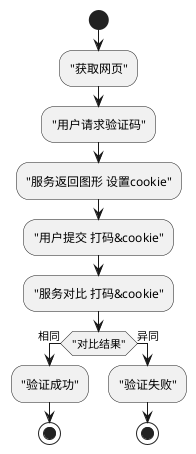

场景
MPA
SPA

# 微前端架构
微前端架构旨在解决单体应用在一个相对长的时间跨度下，由于参与的人员、团队的增多、变迁，从一个普通应用演变成一个巨石应用(Frontend Monolith)后，随之而来的应用不可维护的问题
[qiankun乾坤](https://github.com/umijs/qiankun)
[文档](https://qiankun.umijs.org/zh)

################
## 运行时
文件结构

配置列表
CONF_BW = {
  THEME:     '主题站点',
  SKIN:      '主题皮肤',
  TITLE:     '站点标题',
  COPYRIGHT: '备案信息',
}
RES_PUBLIC: 
RES_PRIVATE: CONF_BW.THEME

场景：
新增一个主题站点
新增一个主题皮肤
主题皮肤变更指引：资源变迁 

## 构建时
CONF_THEME = {
  THEME: {
    SKIN:      '主题皮肤',
    // 私有资源注册Private Resource Registration
    PRR:{
      addr: THEME // 可自定义
      res: []
    }
  }
}
打包指定站点
打包配置列表
生成场景引导 新成员
开发规范说明 新成员
公共私有目录查询

初始：
生成 THEME:配置 映射表  依据THEME快速查询

解决方案：

# 人机验证
暴力破解密码  频繁操作导致服务器压力崩溃的恶意攻击
数字、字母、中文的组合 缺点：用户需要在鼠标-键盘、中英文之间切换，不具备任何趣味性
