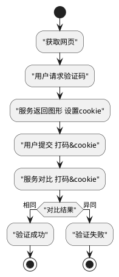

场景

# 人机验证
暴力破解密码  频繁操作导致服务器压力崩溃的恶意攻击
数字、字母、中文的组合 缺点：用户需要在鼠标-键盘、中英文之间切换，不具备任何趣味性

```plantuml
@startuml
start
:"获取网页";
:"用户请求验证码";
:"服务返回图形 设置cookie";
:"用户提交 打码&cookie";
:"服务对比 打码&cookie";

if ("对比结果") then (相同)
    :"验证成功";
    stop
else (异同)
    :"验证失败";
    stop
endif
@enduml
```