[官网](http://plantuml.com/en/guide)


### 1. 配置
```js
window.$docsify = {
    plantuml: {
        skin: 'classic', // default/classic
        renderSvgAsObject: true, // 使用交互式svg,呈现变为<object type='image/svg+xml' data=''/>
        //serverPath: '', // 配置自己的PlantUML服务器
    },
}
```

### 2. 引入处理脚本

`<script src="//unpkg.com/docsify-plantuml/dist/docsify-plantuml.min.js"></script>`

### 3. 使用

#### Salt (wireframe)
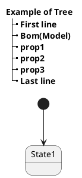
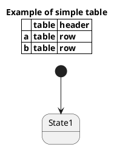
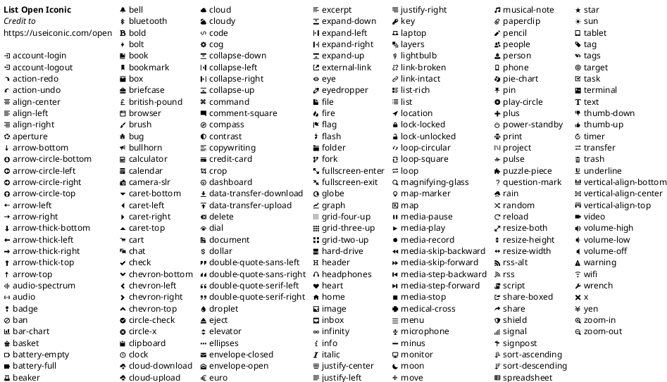
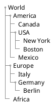

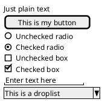
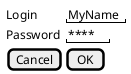

#### 数学
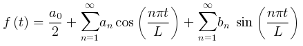

#### 工作分解结构
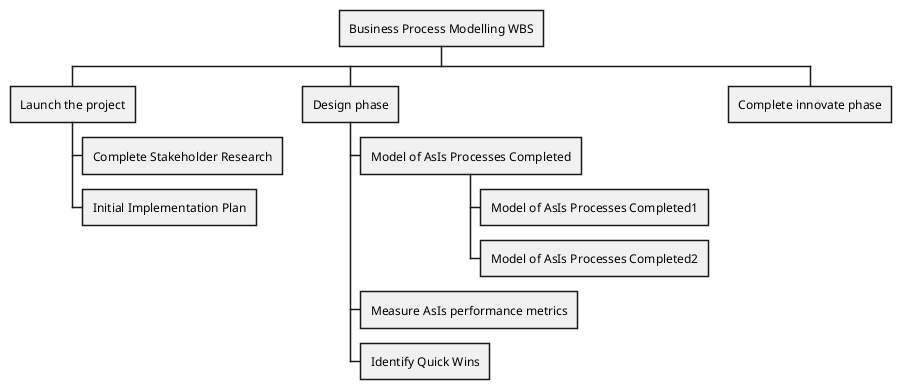

#### 思维导图
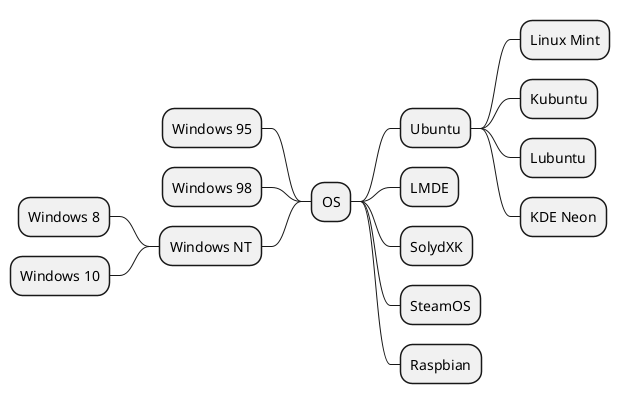
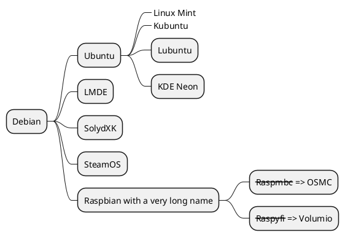
```
@startmindmap
* Debian
** Ubuntu
***_ Linux Mint
***_ Kubuntu
*** Lubuntu
*** KDE Neon
** LMDE
** SolydXK
** SteamOS
** Raspbian with a very long name
*** <s>Raspmbc</s> => OSMC
*** <s>Raspyfi</s> => Volumio
@endmindmap
```

#### 甘特图
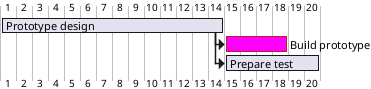
```
@startgantt
[Prototype design] lasts 14 days
[Build prototype] lasts 4 days
[Prepare test] lasts 6 days
[Prototype design] -> [Build prototype]
[Prototype design] -> [Prepare test]
[Build prototype] is colored in Fuchsia/FireBrick
@endgantt
```

#### 流程图
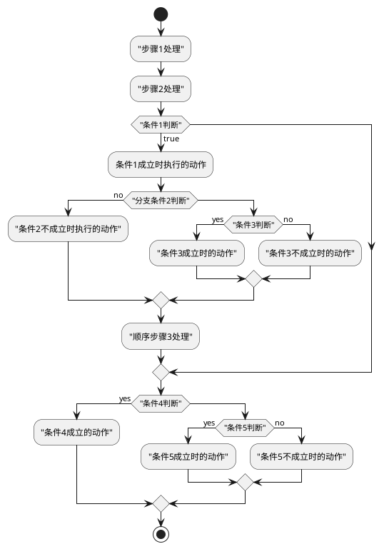
```
@startuml
start
:"步骤1处理";
:"步骤2处理";
if ("条件1判断") then (true)
    :条件1成立时执行的动作;
    if ("分支条件2判断") then (no)
        :"条件2不成立时执行的动作";
    else
        if ("条件3判断") then (yes)
            :"条件3成立时的动作";
        else (no)
            :"条件3不成立时的动作";
        endif
    endif
    :"顺序步骤3处理";
endif
if ("条件4判断") then (yes)
:"条件4成立的动作";
else
    if ("条件5判断") then (yes)
        :"条件5成立时的动作";
    else (no)
        :"条件5不成立时的动作";
    endif
endif
stop
@enduml
```


#### 时序图
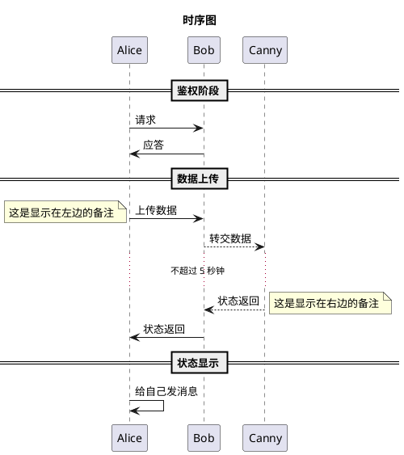
#### 用例图
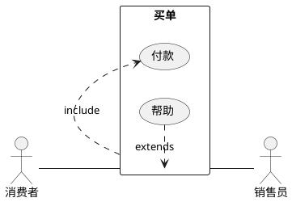

#### 组件图
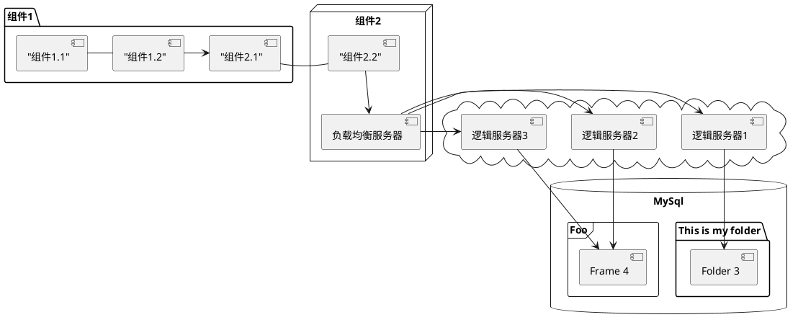

#### 状态图
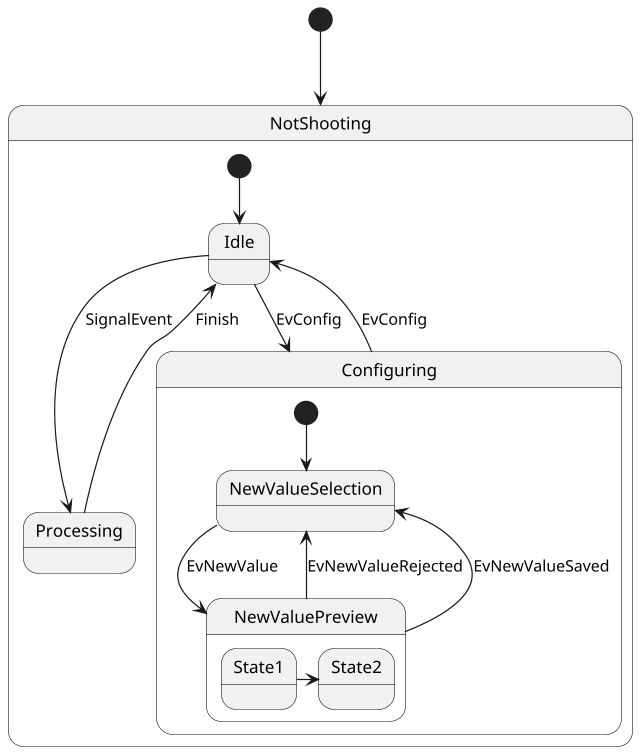