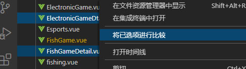

 CAWD-119
### settings
```js
{
  // 缩进
  "editor.detectIndentation": false, // 默认启用了根据文件类型自动设置tabSize
  "editor.tabSize": 2, // 设置缩进不生效时关闭editor.detectIndentation

  // koroFileHeader 插件
  "fileheader.customMade": { // 头部注释
    "autoAdd": false,        // 关闭自动添加头部注释
    "Description":"file content",
    "Version": "2.0"
    "Author":"Ewan",
    "Date":"Do not edit",
    "LastEditors":"Ewan",
    "LastEditTime":"Do not edit"    
  },
  "fileheader.cursorMode": { // 函数注释
    "description":"",
    "param":"",
    "return":"",
    "author":"Ewan"
  }
}
```
### 功能
对比<br>


### 插件
```table title link
#####| JSON Tools
Ctrl(Cmd)+Alt+M    格式化代码
Alt+M              紧凑化代码

#####| koroFileHeader
ctrl + Alt + i     文件头部注释 [fileheader.customMade](pages/tools/vscode.md?id=settings)
ctrl + Alt + t     在鼠标位置插入相应的注释 [fileheader.cursorMode](pages/tools/vscode.md?id=settings)
```

### 用户片段
文件 > 首选项 > 用户片段
```dianzhui popover
{
  "[0 Print to console]": {
    "(prefix)(触发快捷提示的字符串前缀)": "[1 log]",
    "(body)(代码片段主体)": [
      "console.log('$1');",
      "$2"
    ],
    "description": "打印到控制台"
  },
  "[0 Add format comment]": {
    "prefix": "[1 comment]",
    "body": [
      "/**",
      " * ",
      " * Ewan $(l3)CURRENT_YEAR(/l3)-$CURRENT_MONTH-$(l4)CURRENT_DATE(/l4) $CURRENT_HOUR:$(l5)CURRENT_MINUTE(/l5)",
      " */"
    ],
    "description": "添加注释"
  }
}
```

### 变量
调用: $变量名 
```table
TM_FILENAME               当前文件名
TM_FILENAME_BASE          当前文件名，不带扩展名
CURRENT_YEAR              当前年份
CURRENT_YEAR_SHORT        当前年份，最后两位数字
CURRENT_MONTH             当前月份数字形式，两位表示
CURRENT_MONTH_NAME        当前月份英文形式，如 July
CURRENT_MONTH_NAME_SHORT  当前月份英文缩写形式，如 Jul
CURRENT_DATE              当前日
CURRENT_DAY_NAME          当前星期，如 Monday
CURRENT_DAY_NAME_SHORT    当前星期缩写形式，如 Mon
CURRENT_HOUR              当前小时，24小时格式，两位表示
CURRENT_MINUTE            当前分钟，两位表示
CURRENT_SECOND            当前秒，两位表示
TM_DIRECTORY              当前文件所属目录的绝对路径
TM_FILEPATH               当前文件的绝对路径
```