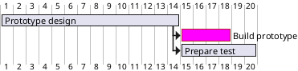

### ewan-layout
<!-- layout:start -->
<!-- col:2 -->
  2/24
<!-- col:2 -->
  2/24
<!-- col:2 -->
  2/24
<!-- col:2 -->
  2/24
<!-- col:2 -->
  2/24
<!-- col:2 -->
  2/24  
<!-- col:2 -->
  2/24
<!-- col:2 -->
  2/24
<!-- col:2 -->
  2/24
<!-- col:2 -->
  2/24
<!-- col:2 -->
  2/24
<!-- col:2 -->
  2/24
<!-- layout:end -->

<!-- layout:start -->
<!-- col:8 -->
  8/24
<!-- col:8 -->
  8/24
<!-- col:8 -->
  8/24
<!-- layout:end -->

```
<!-- layout:start -->
<!-- col:8 -->
  24/24
<!-- layout:end -->
```

### docsify-plantuml
[PlantUML](../tools/plantuml) 
[数学](../tools/plantuml?id=数学) 
[工作分解结构](../tools/plantuml?id=工作分解结构) 
[思维导图](../tools/plantuml?id=思维导图) 
[甘特图](../tools/plantuml?id=甘特图) 
[流程图](../tools/plantuml?id=流程图) 
[时序图](../tools/plantuml?id=时序图) 
[用例图](../tools/plantuml?id=用例图) 
[组件图](../tools/plantuml?id=组件图) 
[状态图](../tools/plantuml?id=状态图) 



### docsify-tabs
<!-- tabs:start -->
#### ** 第一步 **
index.html `<script src="https://cdn.jsdelivr.net/npm/docsify-tabs@1"></script>`
#### ** 第二步 **
```javascript
window.$docsify = {
  // ...
  tabs: {
    persist    : true,      // default
    sync       : true,      // default
    theme      : 'classic', // default
    tabComments: true,      // default
    tabHeadings: true       // default
  }
}
```
#### ** 第三步 **
添加css变量
```html
<style>
  :root {
    --docsifytabs-border-color: #ededed;
    --docsifytabs-tab-highlight-color: purple;
  }
  .docsify-tabs__tab~.docsify-tabs__tab{outline:none;} /* 去除蓝框 */
  .docsify-tabs--classic .docsify-tabs__tab:first-of-type {outline:none;}
</style>
```
#### ** 使用 **
```
<!-- tabs:start -->
#### ** English **
Hello!
#### ** French **
Bonjour!
#### ** Italian **
Ciao!
<!-- tabs:end -->
```
<!-- tabs:end -->


### docsify-plugin-flexible-alerts
<!-- tabs:start -->
#### ** 第一步a **
index.html `<script src="https://unpkg.com/docsify-plugin-flexible-alerts"></script>`
#### ** 第二步a **
```javascript
  window.$docsify = {
    // ...
    'flexible-alerts': {
      style: 'flat'
    }
  };
```
#### ** 使用a **
```html
> [!NOTE]
> An alert of type 'note' using global style 'callout'.

> [!NOTE|style:flat]
> An alert of type 'note' using alert specific style 'flat' which overrides global style 'callout'.

> [!TIP]
> An alert of type 'tip' using global style 'callout'.

> [!WARNING]
> An alert of type 'warning' using global style 'callout'.

> [!ATTENTION]
> An alert of type 'attention' using global style 'callout'.

> [!COMMENT]
> An alert of type 'comment' using style 'callout' with default settings.
```
#### ** 官网a **
https://github.com/fzankl/docsify-plugin-flexible-alerts
<!-- tabs:end -->

<!-- layout:start -->
<!-- col:12 -->

  > [!NOTE]
  > An alert of type 'note' using global style 'callout'.

  > [!NOTE|style:flat]
  > An alert of type 'note' using alert specific style 'flat' which overrides global style 'callout'.

  > [!TIP]
  > An alert of type 'tip' using global style 'callout'.
<!-- col:12 -->

  > [!WARNING]
  > An alert of type 'warning' using global style 'callout'.

  > [!ATTENTION]
  > An alert of type 'attention' using global style 'callout'.

  > [!COMMENT]
  > An alert of type 'comment' using style 'callout' with default settings.
<!-- layout:end -->


　　缩进(全角空格"　")<br>
空格
|&thinsp;|&#8201;|&#x2009;
|&nbsp;|&#160;|&#xA0;
|&ensp;|&#8194;|&#x2002;
|&emsp;|&#8195;|&#x2003;
<font face=“微软雅黑”>字体</font><font font size=5>字号</font><font color=red>颜色</font>**加粗** *斜体* 　　


# 这是一级标题
## 这是二级标题
### 这是三级标题
#### 这是四级标题
##### 这是五级标题
###### 这是六级标题
```markdown
# 这是一级标题
## 这是二级标题
### 这是三级标题
#### 这是四级标题
##### 这是五级标题
###### 这是六级标题
```

**这是加粗的文字**<br>
*这是倾斜的文字*<br>
***这是斜体加粗的文字***<br>
~~这是加删除线的文字~~<br>
```
**这是加粗的文字**
*这是倾斜的文字*
***这是斜体加粗的文字***
~~这是加删除线的文字~~
```

>这是引用的内容
>>这是引用的内容
>>>>>>>>>>这是引用的内容
---
----
***
*****
```
>这是引用的内容
>>这是引用的内容
>>>>>>>>>>这是引用的内容
---
----
***
*****
```


图片alt就是显示在图片下面的文字，相当于对图片内容的解释。
图片title是图片的标题，当鼠标移到图片上时显示的内容。title可加可不加


[超链接名](超链接地址 "超链接title")<br>
[简书](http://jianshu.com)
[百度](http://baidu.com)<br>
<a href="http://baidu.com" target="_blank">新窗口百度</a>


- 列表内容
+ 列表内容
* 列表内容

注意：- + * 跟内容之间都要有一个空格

1. 列表内容
2. 列表内容
3. 列表内容

注意：序号跟内容之间要有空格

- 列表内容
  - 列表内容
  - 列表内容
  - 列表内容
+ 列表内容
  - 列表内容
  - 列表内容
  - 列表内容

```
  - 列表内容
  + 列表内容
  * 列表内容

  1. 列表内容
  2. 列表内容
  3. 列表内容

  - 列表内容
    - 列表内容
    - 列表内容
    - 列表内容
  + 列表内容
    - 列表内容
    - 列表内容
    - 列表内容
```

表头表头|表头|表头表头
:-----:|--|---:
内容|内容|内容
内容|内容|内容
```
表头表头|表头|表头表头
:-----:|--|---:
内容|内容|内容
内容|内容|内容
```
第二行分割表头和内容。<br>
- 有一个就行，为了对齐，多加了几个<br>
文字默认居左<br>
-两边加：表示文字居中<br>
-右边加：表示文字居右<br>
注：原生的语法两边都要用 | 包起来。此处省略


代码块
`let i = 0`

```js
function fun(){
    echo "这是一句非常牛逼的代码";
}
fun()

const name = 'ewan'
const age = 20
console.log(name)
console.log(age)
```

流程图
```
st=>start: 开始
op=>operation: My Operation
cond=>condition: Yes or No?
e=>end
st->op->cond
cond(yes)->e
cond(no)->op
&
```


# Docsify 示例

<p align="center">
  <a href="https://docsify.js.org">
    
  </a>
</p>

<p align="center">
  A magical documentation site generator.
</p>

<p align="center">
  <a href="#backers"></a>
  <a href="#sponsors"></a>
  <a href="https://travis-ci.org/docsifyjs/docsify"></a>
  <a href="https://www.npmjs.com/package/docsify"></a>
  <a href="https://github.com/QingWei-Li/donate"></a>
  <a href="https://gitter.im/docsifyjs/Lobby?utm_source=share-link&utm_medium=link&utm_campaign=share-link"></a>
</p>

<p align="center">Gold Sponsor via <a href="https://opencollective.com/docsify">Open Collective</a></p>

<p align="center">
  <a href="https://opencollective.com/docsify/order/3254">
    
  </a>
</p>

## Links

- [Documentation](https://docsify.js.org)
- [CLI](https://github.com/docsifyjs/docsify-cli)
- CDN: [UNPKG](https://unpkg.com/docsify/) | [jsDelivr](https://cdn.jsdelivr.net/npm/docsify/) | [cdnjs](https://cdnjs.com/libraries/docsify)
- [Awesome docsify](https://github.com/docsifyjs/awesome-docsify)
- [Community chat](https://gitter.im/docsifyjs/Lobby)

## Features

- No statically built html files
- Simple and lightweight (~21kB gzipped)
- Smart full-text search plugin
- Multiple themes
- Useful plugin API
- Compatible with IE10+
- Support SSR ([example](https://github.com/docsifyjs/docsify-ssr-demo))
- Support embedded files

## Quick start

Look at [this tutorial](https://docsify.js.org/#/quickstart)

[](https://codesandbox.io/s/307qqv236)

## Showcase

These projects are using docsify to generate their sites. Pull requests welcome :blush:

Move to [awesome-docsify](https://github.com/docsifyjs/awesome-docsify)

## Similar projects

| Project                                          | Description                              |
| ------------------------------------------------ | ---------------------------------------- |
| [docute](https://github.com/egoist/docute)       | 📜 Effortlessly documentation done right |
| [docpress](https://github.com/docpress/docpress) | Documentation website generator          |

## Contributing

- Fork it!
- Create your feature branch: `git checkout -b my-new-feature`
- Commit your changes: `git commit -am 'Add some feature'`
- Push to the branch: `git push origin my-new-feature`
- Submit a pull request

## Development

```bash
npm run bootstrap && npm run dev
```

## Backers

Thank you to all our backers! 🙏 [[Become a backer](https://opencollective.com/docsify#backers)]

<a href="https://opencollective.com/docsify#backers" target="_blank"></a>

## Sponsors

Support this project by becoming a sponsor. Your logo will show up here with a link to your website. [[Become a sponsor](https://opencollective.com/docsify#silver-sponsors)]

<a href="https://opencollective.com/docsify/silver-sponsors/0/website" target="_blank"></a>
<a href="https://opencollective.com/docsify/silver-sponsors/1/website" target="_blank"></a>
<a href="https://opencollective.com/docsify/silver-sponsors/2/website" target="_blank"></a>
<a href="https://opencollective.com/docsify/silver-sponsors/3/website" target="_blank"></a>
<a href="https://opencollective.com/docsify/silver-sponsors/4/website" target="_blank"></a>
<a href="https://opencollective.com/docsify/silver-sponsors/5/website" target="_blank"></a>
<a href="https://opencollective.com/docsify/silver-sponsors/6/website" target="_blank"></a>
<a href="https://opencollective.com/docsify/silver-sponsors/7/website" target="_blank"></a>
<a href="https://opencollective.com/docsify/silver-sponsors/8/website" target="_blank"></a>

## Contributors

This project exists thanks to all the people who contribute. [[Contribute](CONTRIBUTING.md)].
<a href="https://github.com/docsifyjs/docsify/graphs/contributors"></a>

## License

[MIT](LICENSE)

[](https://app.fossa.io/projects/git%2Bhttps%3A%2F%2Fgithub.com%2Fdocsifyjs%2Fdocsify?ref=badge_large)


### 绘制流程图 Flowchart
st=>start: 用户登陆
op=>operation: 登陆操作
cond=>condition: 登陆成功 Yes or No?
e=>end: 进入后台

st->op->cond
cond(yes)->e
cond(no)->op
```flow
st=>start: 用户登陆
op=>operation: 登陆操作
cond=>condition: 登陆成功 Yes or No?
e=>end: 进入后台

st->op->cond
cond(yes)->e
cond(no)->op
```
[========]

### 绘制序列图 Sequence Diagram

```seq
Andrew->China: Says Hello
Note right of China: China thinks\nabout it
China-->Andrew: How are you?
Andrew->>China: I am good thanks!
```
